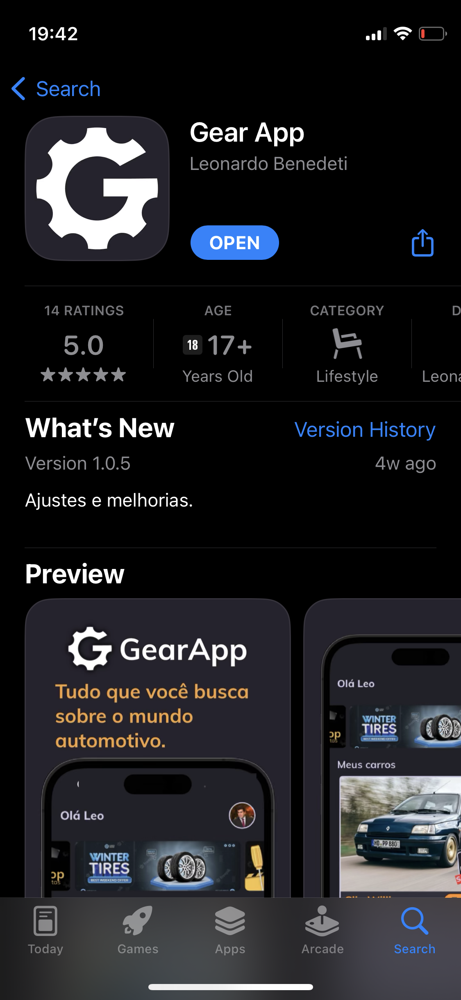
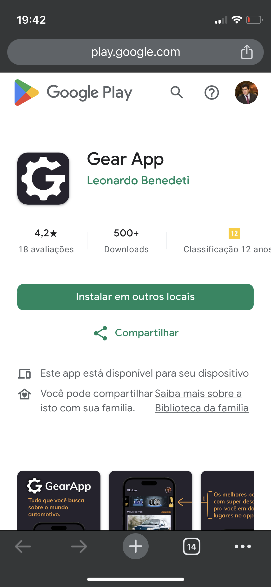

### Contexto geral e história

App criado pra fugir das amarras do mundo corporativo, sim, por uma época me senti muito frustrado em alguns projetos por precisar seguir as diretrizes previamente definidas para os projetos e com isso acabei iniciando o desenvolvimento do Gear App como uma brincadeira, uma válvula de escape, pra conseguir respirar e fazer algo do meu jeito.

Outro fator que corroborou foi que recentemente eu acabara de remover um app publicado da loja, não tendo nenhum app publicado diretamente por mim nas lojas, perdendo assim um diferencial gigante perante a outros profissionais na hora de uma entrevista ou algo do tipo.

Passando o tempo, preenchendo essa vontade, acabei desenvolvendo um produto maior do que eu esperava e percebi que tinha não apenas um app em mãos, mas sim um negócio e o melhor de tudo, um negócio que unia minha profissão com o setor automotivo, que no caso sempre fui fã e passei horas consumindo conteúdos sobre.

### Tecniquês

O projeto iniciou com uma arquitetura baseada em Clean mas um pouco mais simples e com MobX para gestão de estado. Porém com o passar do tempo o código virou uma bagunça e decidi retornar ao costumeiro Bloc, facilitando ainda mais com o uso do Cubit. 

Atualmente o app está publicado em ambas lojas, AppStore e Google Play e em ambas lojas com uma boa nota. 

Estamos atualmente estruturando mais ainda a base do app e do backoffice para começar a divulgar mais ainda o projeto e ganhar mercado, mas já estamos próximos a 1500 usuários e pouco mais de 600 seguidores no instagram.

O maior feedback é que o app é muito bem feito e não trava como alguns apps do setor automotivo. 

  
  

Pra encontrar o app nas lojas é bem simples, só buscar por Gear App que é o primeiro a aparecer caso seu celular seja compatível. 

Ou você também pode entrar no site do <a href="https://gearapp.com.br/" target="_blank">GearApp</a> pra ter acesso aos links das lojas.

### Atualizações.... em breve
