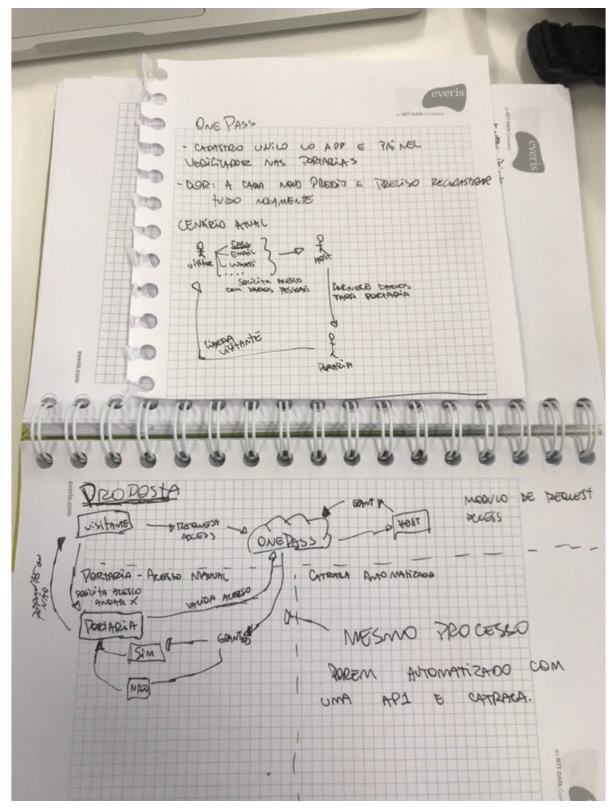

## Ideias

#### OnePass - Sistema de gerenciamento de acesso a predios

Todo predio com uma média segurança hoje requer um cadastro para um acesso. 
Mas para o acesso em si é necessário uma autorização de algum funcionário de alguma empresa que atua no prédio. 

Até ai normal, todos os dias muitos cadastros são efetuados e isso já faz parte da cultura de grandes empresas em são paulo, principalmente consultorias.

Mas e se existisse uma solução que melhorasse esse fluxo? 
Porque pensando no melhor dos casos ao chegar na portaria e solicitar entrada, seu contato no prédio vai estar esperando a validação da portaria para liberar seu acesso. LINDO.

Poreeeeeem, quem nunca ficou aguardando o contato na empresa voltar do almoço, sair de uma reunião ou até atender o telefone por conta de uma partida de algum jogo no celular ?

Com isso muito tempo é desperdiçado, e ambas partes perdem com isso. 

COm um processo mais agil de liberação desse visitante, torna o processo de visita ao prédio muito mais produtivo e fácil.

Mas como fariamos isso ?

Um portal de acesso unico. Onde o visitante requisita o acesso e o contato da empresa aceita esse acesso.
Com isso fica mais simples a portaria validar que o visitante está autorizado a subir para fazer o que precisa.

